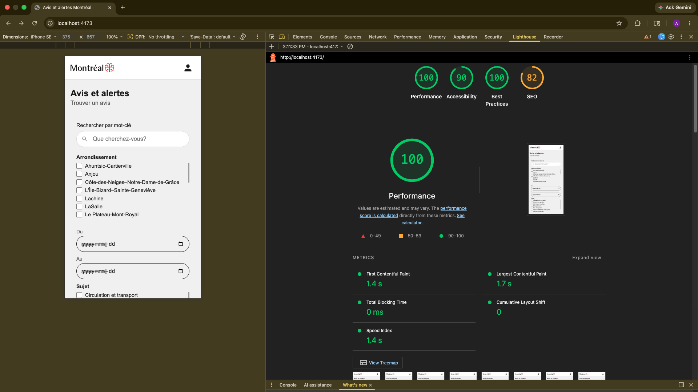

# Avis et alertes – Ville de Montréal

Application PWA full-stack reproduisant la page des avis et alertes de la Ville de Montréal, avec notifications push et fonctionnement hors connexion.

## Étudiant

Adam Drabo

## Organisation du dépôt

```
Avis-alertes-mtl/
├── backend/     → Serveur Express.js (API REST + notifications push)
├── frontend/    → Application PWA React
└── docs/        → Rapport technique
```

## URLs de déploiement

- **Frontend** : https://alerte-ville-mtl.vercel.app
- **Backend** : https://avis-alertes-backend.onrender.com

## Installation et démarrage

### Prérequis

- Node.js (v18 ou plus)
- npm
- Compte MongoDB Atlas
- Compte Render (backend)
- Compte Vercel (frontend)

### Backend

1. Cloner le dépôt :

```
git clone https://github.com/adamdrabo/alerte-ville-mtl.git
cd alerte-ville-mtl/backend
```

2. Installer les dépendances :

```
npm install
```

3. Créer le fichier `.env` à partir du modèle :

```
cp .env.example .env
```

4. Remplir les variables dans `.env` :

```
PORT=3000
VAPID_PUBLIC_KEY=votre_cle_publique
VAPID_PRIVATE_KEY=votre_cle_privee
VAPID_EMAIL=mailto:votre@email.com
MONGODB_URI=votre_uri_mongodb_atlas
```

5. Générer les clés VAPID :

```
node -e "const webpush = require('web-push'); const keys = webpush.generateVAPIDKeys(); console.log(keys);"
```

6. Lancer le serveur :

```
npm run dev
```

Le serveur démarre sur http://localhost:3000

### Frontend

1. Aller dans le dossier frontend :

```
cd alerte-ville-mtl/frontend
```

2. Installer les dépendances :

```
npm install
```

3. Lancer le serveur de développement :

```
npm run dev
```

Ouvrir http://localhost:5173

## Tester l'envoi de notifications

1. Ouvrir https://alerte-ville-mtl.vercel.app dans Safari sur iPhone
2. Ajouter à l'écran d'accueil via le menu Partage
3. Lancer l'app depuis l'icône sur l'écran d'accueil
4. Cliquer sur **M'abonner** et accepter les notifications
5. Depuis Postman, envoyer une requête POST :

```
POST https://avis-alertes-backend.onrender.com/send-notification
Content-Type: application/json

{
  "title": "Nouveau avis",
  "body": "Un nouvel avis a été émis par la Ville de Montréal",
  "url": "/"
}
```

6. La notification apparaît sur l'appareil abonné
7. Cliquer sur la notification ouvre l'application sur la page pertinente

## Variables d'environnement

| Variable | Description |
|---|---|
| `PORT` | Port du serveur Express |
| `VAPID_PUBLIC_KEY` | Clé publique VAPID pour les notifications push |
| `VAPID_PRIVATE_KEY` | Clé privée VAPID |
| `VAPID_EMAIL` | Email de contact VAPID |
| `MONGODB_URI` | URI de connexion MongoDB Atlas |

## Choix techniques

### Architecture full-stack

Le frontend React appelle le backend Express au lieu de l'API de la Ville directement. Le backend récupère, normalise et distribue les données. Ce découplage facilite la maintenance et la sécurité.

### Normalisation des données

Une fonction de mapping isolée dans `backend/utils/normaliser.js` convertit la réponse brute de l'API de la Ville vers le modèle interne. Le frontend reçoit des données déjà normalisées.

### Base de données

MongoDB Atlas stocke les abonnements push avec leur endpoint unique et leurs clés cryptographiques (p256dh, auth).

### Gestion de l'état

L'état est géré uniquement avec `useState` et `useEffect` natifs de React, sans bibliothèque externe. Les filtres enrichis supportent la sélection multiple pour les arrondissements et les sujets.

### Routage

`react-router-dom` v7 est utilisé pour le routage côté client. La page de détail est accessible via l'URL `/alertes/:id`.

### Responsive

L'interface est adaptée aux mobiles à partir de 360px avec un breakpoint à 768px pour la version bureau.

## Stratégie de mise en cache

Deux stratégies sont utilisées dans `frontend/public/sw.js` :

### Assets statiques — Cache First

Les fichiers JS, CSS et HTML sont précachés à l'installation du Service Worker. Lors d'une requête, le cache est consulté en premier. Si la ressource est absente du cache, elle est récupérée depuis le réseau et mise en cache dynamiquement.

Cette stratégie est choisie car les assets statiques changent rarement et doivent être disponibles hors connexion.

### Données API — Stale-While-Revalidate

Les requêtes vers le backend sont servies depuis le cache immédiatement, pendant que le Service Worker va chercher une version fraîche en arrière-plan et met à jour le cache.

Cette stratégie est choisie car elle offre un affichage instantané tout en assurant la fraîcheur des données à la prochaine consultation.

## Fonctionnalités PWA

- Installable sur iOS (Safari) et Android (Chrome)
- Fonctionne hors connexion grâce au Service Worker
- Bannière d'avertissement quand l'utilisateur est hors-ligne
- Les derniers avis téléchargés restent consultables sans réseau
- Notifications push reçues même quand l'app est fermée
- Clic sur notification → navigation vers la page pertinente de l'application

## Scores Lighthouse



- Performance : 100
- Accessibility : 90
- Best Practices : 100
- SEO : 82